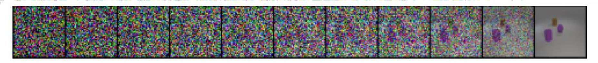
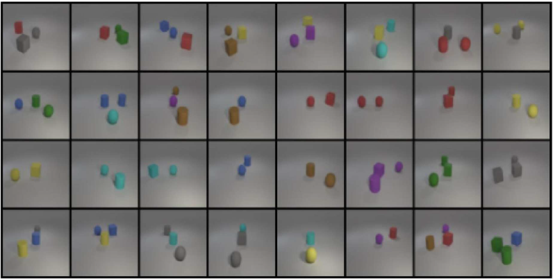

# Scoring Criteria

## 總分分配

|項目|配分|
|---|---|
|報告（Report）|60%|
|實驗結果（Accuracy）|40%|

---

## Report（60%）

### Introduction（5%）

- 簡介 DDPM 與本 lab 目標

### Implementation Details（30%）

- 詳細描述模型架構
- 說明 noise schedule 選擇與理由
- 說明 condition embedding 方法
- 說明 loss function 與 reparameterization 類型
- **請寫詳細（write in detail）**

### Results & Discussion（25%）

|項目|配分|
|---|---|
|Synthetic image grid（test.json）|3%|
|Synthetic image grid（new_test.json）|3%|
|Denoising process（label: red sphere / cyan cylinder / cyan cube）|4%|
|Extra experiments / discussion|15%|

> Extra discussion 佔比最高（15%），建議嘗試多種設定並比較

> Denoising process 參考範例
> 

---

## Experimental Results（40%）

評估以**報告中截圖的 accuracy** 為準。

### 評分標準（每個測試集 20%）

|Accuracy|Grade|
|---|---|
|≥ 0.8|100%|
|0.7 ~ 0.8|90%|
|0.6 ~ 0.7|80%|
|0.5 ~ 0.6|70%|
|0.4 ~ 0.5|60%|
|< 0.4|0%|

> 目標：accuracy ≥ 0.8（滿分），參考範例 new_test.json 達到 F1-score 0.821
> 

### 需提供

- [x] `test.json` accuracy 截圖
- [x] `new_test.json` accuracy 截圖